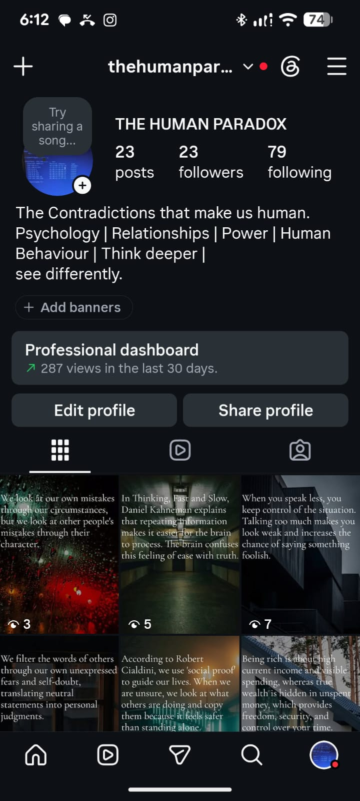
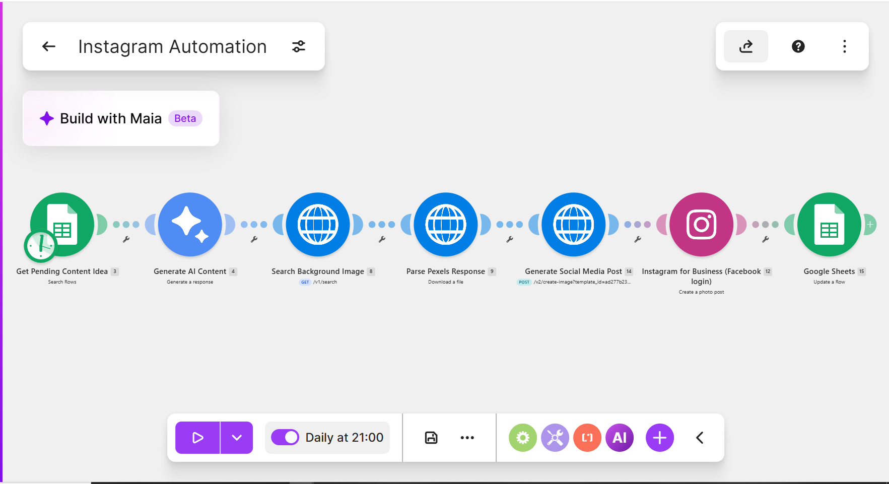
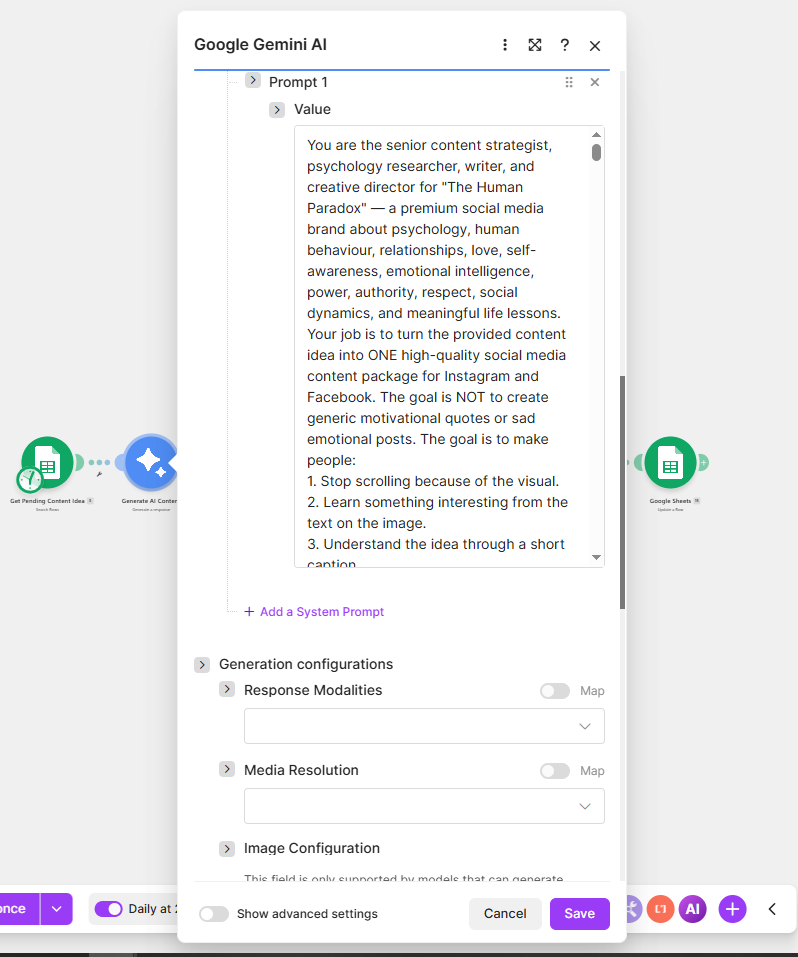
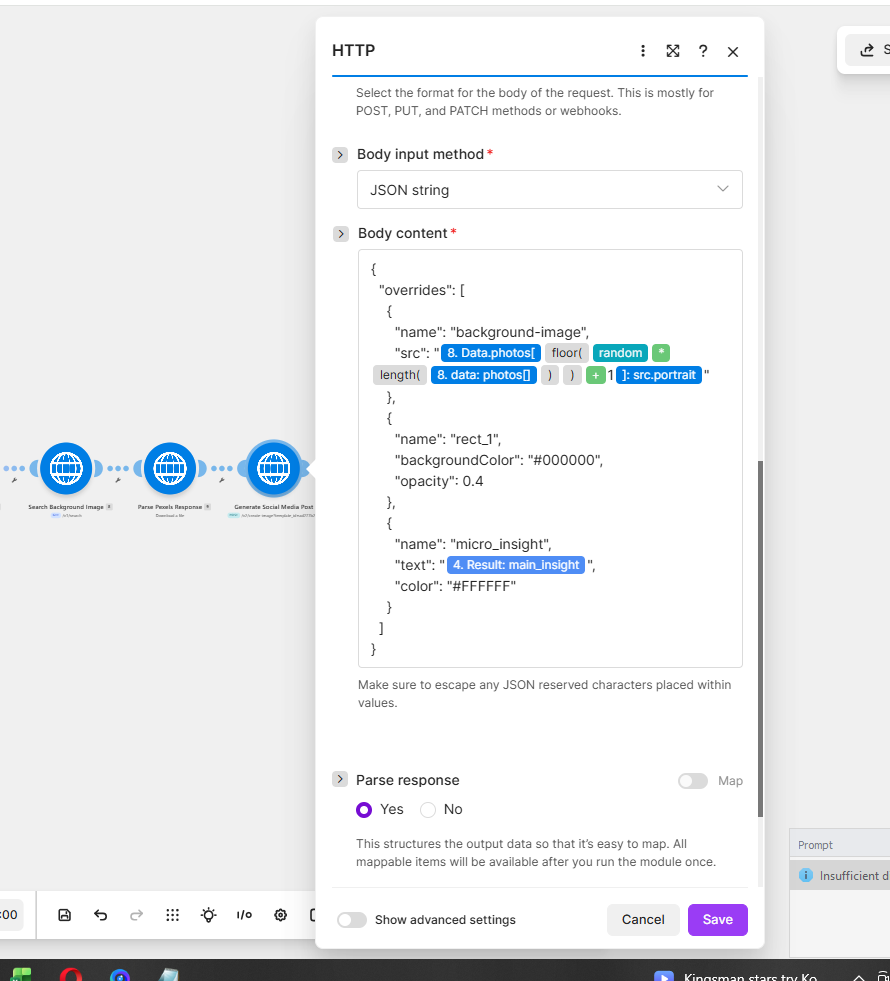
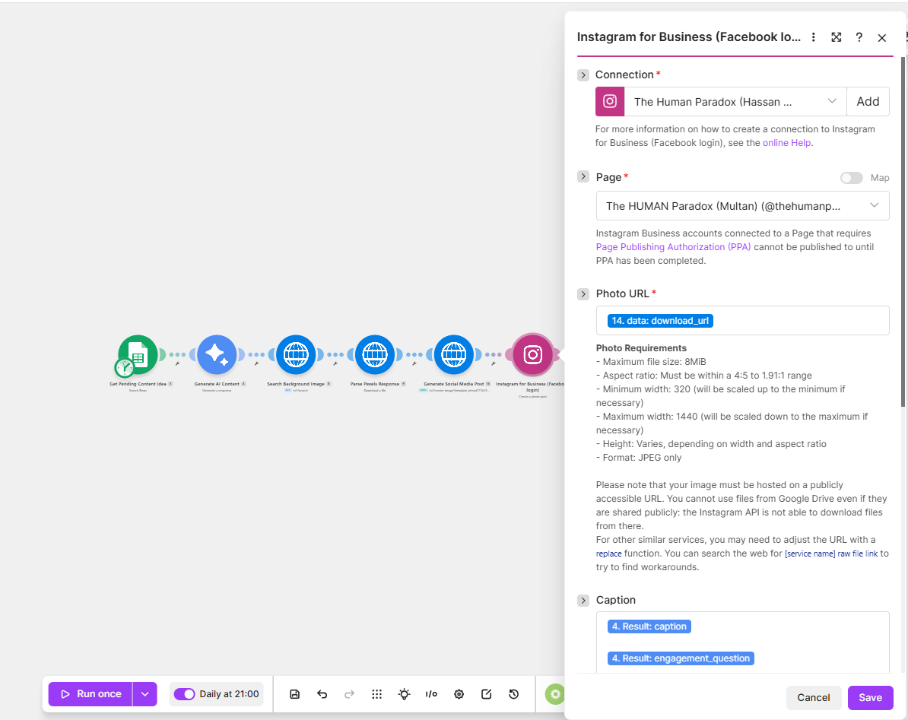

# AI-Powered Instagram Content Automation

## Overview

Creating high-quality Instagram posts every day takes time. You need an idea, a caption, hashtags, a good image, and then you have to publish everything manually.

This project automates that entire process.

Starting with a simple content idea stored in Google Sheets, the workflow generates complete post content with Google Gemini, finds a matching image using the Pexels API, creates the final design with APITemplate, and publishes it directly to Instagram.

The project was built in Make.com to practice real-world AI automation by connecting multiple APIs into one complete workflow.

---

# Example Output

### AI Generated Instagram Post



---

# The Problem

Managing a social media page takes time because every post requires multiple manual steps:

- Writing captions
- Creating hashtags
- Finding suitable images
- Designing the final post
- Publishing it

Repeating these tasks every day becomes slow and inefficient.

---

# The Solution

This automation turns one content idea into a complete Instagram post automatically.

Instead of switching between different tools, the workflow handles everything from content generation to publishing in one automated process.

---

# How It Works

1. Reads the next content idea from Google Sheets.
2. Sends the topic to Google Gemini.
3. Gemini returns a structured JSON response containing the title, caption, hashtags, image search query, and other required fields.
4. The JSON response is parsed inside Make.com.
5. The Pexels API searches for a matching image.
6. APITemplate combines the generated content with the selected image to create the final Instagram post.
7. The completed post is published automatically to Instagram.

---

# Workflow

```text
Google Sheets
        │
        ▼
Google Gemini
        │
        ▼
Parse JSON
        │
        ▼
Pexels API
        │
        ▼
APITemplate
        │
        ▼
Instagram
```

---

# Workflow Screenshot



---

# Key Modules

## Google Gemini

Generates the complete Instagram content package, including the title, hook, caption, hashtags, image search query, and reference information.



---

## APITemplate

Creates the final branded Instagram post using the generated text and the selected image.



---

## Instagram for Business

Publishes the completed post directly to Instagram.



---

# Features

- AI-generated Instagram content
- Automatic caption generation
- Automatic hashtag generation
- Dynamic image search using the Pexels API
- Automated post design with APITemplate
- Automatic Instagram publishing
- JSON parsing
- HTTP API integrations
- End-to-end workflow built in Make.com

---

# Technologies Used

- Make.com
- Google Gemini
- Google Sheets
- Pexels API
- APITemplate
- Instagram for Business
- HTTP
- JSON

---

# What I Learned

Building this project helped me improve my skills in:

- AI workflow design
- Prompt engineering
- API integration
- HTTP requests
- JSON parsing
- Working with multiple external services
- End-to-end automation design
- Building production-style workflows in Make.com

---

# Project Structure

```text
ai-instagram-content-automation
│
├── README.md
├── instagram-automation-blueprint.txt
└── Screenshots
    ├── apitemplate.png
    ├── example-post.png.jpeg
    ├── example-post.png - Copy.jpeg
    ├── full-workflow.png.png
    ├── gemini.png
    └── instagram.png
```

---

# Future Improvements

- Support publishing to multiple social media platforms
- Add automatic approval before publishing
- Store publishing history in Google Sheets
- Improve image selection with additional filters
- Add scheduling options

---

# Blueprint

The Make.com blueprint used in this project is included in this repository.

---

# Author

**Hassan Haider**

I'm an Electrical Engineer transitioning into AI Automation Engineering. I enjoy building practical automation workflows using AI, APIs, and no-code tools to solve real-world problems.
